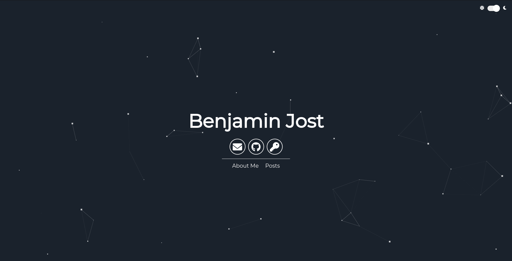
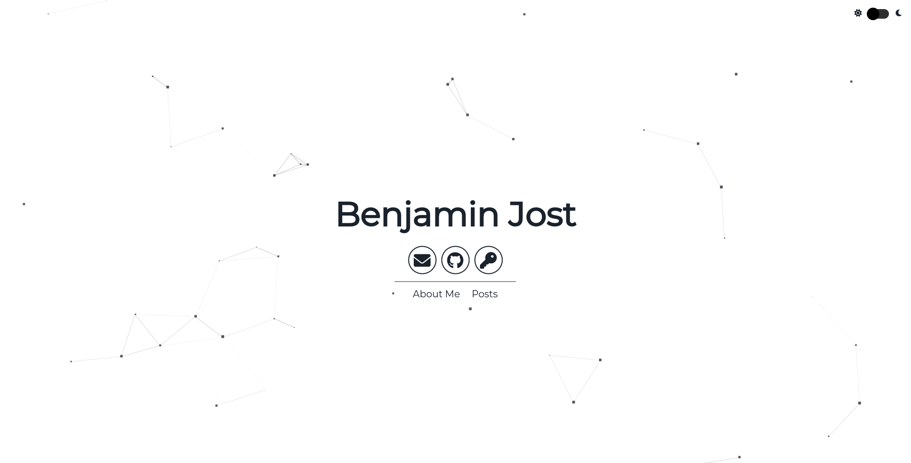

# benjaminjost.github.io

Dark mode             |  Light mode
:-------------------------:|:-------------------------:
  |  

## Setup

1) `sudo docker-compose up`  
2) Navigate to http://localhost:4000  
3) `sudo docker-compose down -v`  

## Site and User Settings

Modify `_config.yml` to customize your site.

```
# Site settings
title: title
description: description of the site
# baseurl: "" # the subpath of your site, e.g. /blog/
# url: "http://localhost:3000" # the base hostname & protocol for your site

permalink: /:title/

# User settings
username: Benjamin Jost
# user_description: description 
# user_title: title

sass:
    style: compressed
```

## Color and Particle Customization
- Color Customization
  - Edit the sass variables
- Particle Customization
  - Edit the json data in particle function in app.js
  - Refer to [Particle.js](https://github.com/VincentGarreau/particles.js/) for help

## License

This project is licensed under the MIT License - see the [LICENSE](LICENSE) file for details.

## Credits

This theme is based on [Nathan Randecker's](https://github.com/nrandecker/particle) repository.
